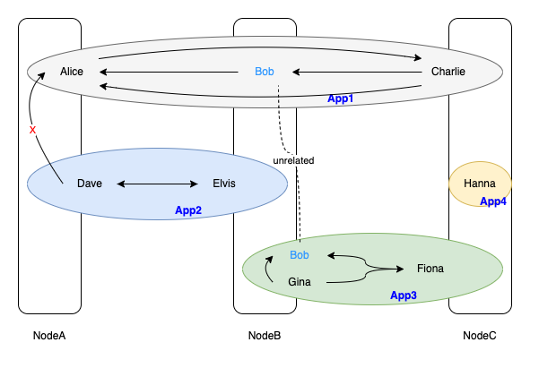

# Corid - Application User Identity Layer for Corda

This cordapp is best viewed as the SDK for the “application side” of the account-sdk (An application can be thought of as a set of cordapps). The major task is to provide a virtual vault for every cordapp application user without conflict (i.e., Bob from app1 is not the same as Bob from app2. Well, maybe they are but allowing vault sharing across applications will result in chaos).

To achieve this, an application must indicate to the underlying (modified) cordapp which application the given user belongs to by showing its NetworkIdentityPlane. Then under the hood, the (modified) cordapp will be able to correctly map the given user (via a combination of its String username and NetworkIdentityPlane identifier) to an AccountInfo. In this way we can make sure that the mapping between application user and AccountInfo is 1-1.

This module primarily provides three sets of functions

* `NetworkIdentityPlane` management
    * Create a plane by specifying its name and participating parties
    * Update a plane (only name for now, more metadata can be added in future)
    * Query plane(s) by name
    * Setting/Retrieving the node's current `NetworkIdentityPlane`
* User management within some `NetworkIdentityPlane`, including virtual vault management
    * Create user at the current plane
    * Vault Queries
        * Retrieve all states for the given type for the user
        * Retrieve the underlying `UUID` to construct more robust query
* Utilities for writing mapped flows from that use `AbstractParty` to ones using `String` username, operating in `NetworkIdentityPlane`s

 